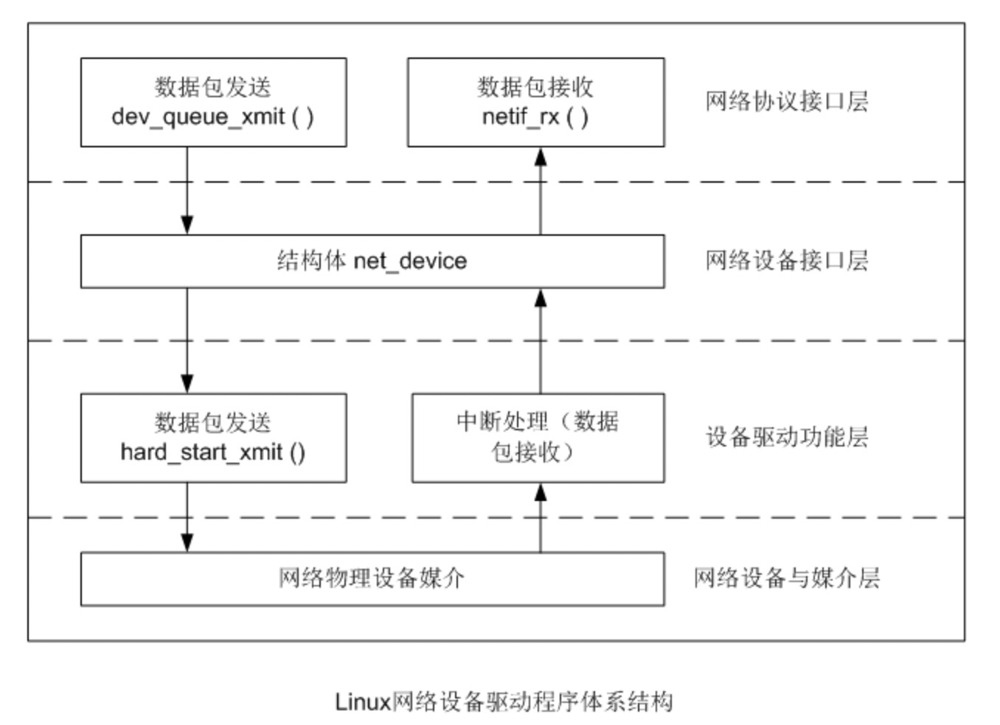

# TSO

**TSO**（TCP Segment Offload）是一种利用网卡的少量处理能力，降低 CPU 发送数据包负载的技术，需要网卡硬件及驱动的支持。

## TSO（TCP Segment Offload）

在不支持 TSO 的网卡上，TCP 层向 IP 层发送数据会考虑 **MSS**，使得 TCP 向下发送的数据可以包含在一个 IP 分组中而不会造成分片，MSS 是在 TCP 初始建立连接时由网卡 MTU 确定并和对端协商的，所以在一个 MTU=1500 的网卡上，TCP 向下发送的数据不会大于 min(mss_local, mss_remote) - IP 头 - TCP 头。

而当网卡支持 TSO 时，TCP 层会逐渐增大 MSS（总是整数倍数增加），当 TCP 层向下发送大块数据时，仅仅计算 TCP 头，网卡接到了 IP 层传下的大数据包后自己重新分成若干个 IP 数据包，添加 IP 头，复制 TCP 头并且重新计算校验和等相关数据，这样就把一部分 CPU 相关的处理工作转移到由网卡来处理。内核 TCP/IP 协议栈也必须考虑下发包数和实际包数不一致的情况，例如处理拥塞控制算法时必须做一些特殊的处理等等。

---

## 1 TCP/IP 协议栈对 TSO 的支持

### 1.1 逐渐增大 MSS（offload）

在不支持 TSO 的网卡上，TCP 层向 IP 层发送数据会考虑 MSS，使得 TCP 向下发送的数据可以包含在一个 IP 分组中而不会造成分片，MSS 是在 TCP 初始建立连接时根据网卡 MTU 确定并和对端协商的，所以在一个 MTU=1500 的网卡上，TCP 向下发送的数据不会大于 min(mss_local, mss_remote) - IP 头 - TCP 头。

在应用层向传输层传输数据时，对于 TCP 协议，最终会调用如下函数：

文件 `net/ipv4/tcp.c`

```c
int tcp_sendmsg(struct kiocb *iocb, struct sock *sk, struct msghdr *msg, size_t size)
```

该函数会调用如下函数：

文件 `net/ipv4/tcp.c`

```c
unsigned int tcp_current_mss(struct sock *sk, int large)
```

获得当前的 MSS 值，如果网卡不支持 TSO，则该函数返回的 MSS 值将和原来相同，否则如果当前不是一个 MSG_OOB 类型的消息，内核将尝试增大 MSS 值，注意：最大的 MSS 值不会大于 65535 - IP 头 - TCP 头。内核根据 /proc 变量 tcp_tso_win_divisor 决定增大后的 MSS 占当前拥塞控制窗口的比率（snd_cwnd）。最终的效果是：增大的 MSS 总是原有 MSS 值的整数倍，但是不会超过 snd_cwnd / tcp_tso_win_divisor。

---

### 1.2 对 skb 计数的修正

在启用 TSO 时，由于 TCP 层向下发送一个 skb，有可能最终会发出 n 个 IP 数据包，即一个 skb 和一个 IP packet 可能不是一一对应的关系，而我们都知道，TCP 拥塞控制算法需要精确跟踪当前发送、接收以及拥塞控制窗口来决定最终发送多少数据包，TSO 的存在给计算带来了一定的复杂性，所以内核在每一个 skb 的末尾维护了额外的数据（struct skb_shared_info，通过 skb_shinfo 取出），表示该 skb 包含多少个 packet。内核提供下列函数操作这块数据：

- tcp_skb_pcount
- tcp_skb_mss
- tcp_inc_pcount
- tcp_inc_pcount_explicit
- tcp_dec_pcount_explicit
- tcp_dec_pcount
- tcp_dec_pcount_approx
- tcp_get_pcount
- tcp_set_pcount
- tcp_packets_out_inc
- tcp_packets_out_dec
- tcp_packets_in_flight

最终，当 TCP 协议栈在调用 tcp_snd_test 决定是否可以发送当前 skb 时，会调用上述函数修正计算结果。

---


