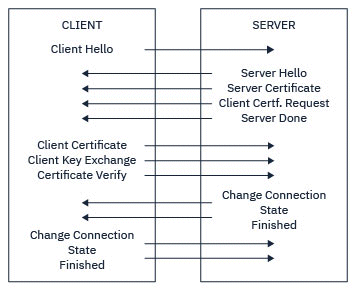

# Telnet 与 SSH

## 如何远程登录一台网络设备，本地登录需要什么？

一个网络设备的登录行为我们称之为 login，登录分成两种：**本地网管**，**远程网管**。

---

### 本地网管 login

将笔记本和网络设备的 Console 口，通过一根控制台线缆 console 线连接。

所有的网络智能设备都具有 Console 口 RJ45 接口。DB9 接口。USB。

通过 SecureCRT 软件登录路由器，Xshell 登录 Linux 服务器，通过 console 口 login 默认不启用认证，适合设备初始化配置。

---

### 远程网管 login

**Telnet** 终端仿真协议：是一款应用层协议，基于 TCP，端口是 23。

用于互联网及局域网中，使用虚拟终端的形式，提供双向、以文字字符串为主的命令行接口交互功能。

是互联网远程登录服务的标准协议和主要方式，常用于服务器的远程控制，可供用户在本地主机运行远程主机上的工作。

让一台网络设备可以基于网络通过 PC 去远程登录，能远程登录的前提是网络连通性必须要好，网管 PC 和被网管设备 router switch 是联通的，可以用 ping 检测。

能 ping 通网络设备的哪个口，就可以用哪个口登录，网络设备开启 Telnet，开启认证。线下密钥认证。

Interface 数据接口连接网络的。

LAN 接口一般是网管接口（华为 User Interface）Console VTY 虚拟终端接口5个 0-4，用于远程登录口。

用户名密码认证，要求登录者出示 username+password，网络设备本地用户名密码保存，本地认证数据库里 RAM，方便不同人操作网络设备。

AAA 内网设置一台 AAA 服务器 ACS ISE（用户名密码），还有一种本地 AAA 认证。

权限 0-15，console 口登录权限是 15，telnet 是 0 级权限。可以给不同的用户划分不同级别的权限，间接实现了 RBAC 基于角色的访问控制，FCoE 存储连接，A 组负责网络，B 组负责存储。

**Telnet 的问题**是，在网络传输往返数据的时候都是明文，没有加密，只要黑客做一个中间人攻击，PC --- 黑客 --- R，

PC 的流量先到达黑客主机，黑客主机再帮你转发到路由器 R，R 回包给黑客，黑客再把流量转发给 PC，PC 将黑客当成了 R，R 将黑客当成了 PC，用户名密码被黑客轻松拿到。

登录密码都保护不了，你还能保护什么呢。

当用 Telnet 登录远程设备的时候，远程登录是一个明文的行为。在敲命令的时候，每一个命令字符都是通过明文的形式进行传递的。

这个时候只要在网管 PC 和被网管路由器之间，如果有黑客存在。做一个中间人攻击，他只要能截获你的远程网管流量，这个时候他就能知道你敲的命令是哪些。

你敲的命令内容里面有用户名和密码，一些比较隐私的参数的时候，这就代表黑客破解了你的密码，因此是非常不安全的。

- Client：网管 PC
- Server：被登录的网络设备

Server：登录认证，通过启用 VTY 接口，Client 向通过 VTY 接口发起登录请求。

在 Client 和 Server 之间建立一个网管会话，通过这个网管会话就可以进行远程操作了。

---

## SSH

**SSH** (Secure Shell，安全外壳协议) 一项计算机上的安全协议，也是应用层协议，基于 TCP，端口号 22。

通过对发送的数据加密来解决中间人攻击直接查看数据，可在不安全的网络中为网络服务提供安全的传输环境。

SSH 最常见的用途是远程登录系统，人们通常利用 SSH 来传输命令行界面和远程执行命令。

斯诺登，棱镜门，爆出美国国家安全局已经开始破解 SSH 的通信消息了，暴力和字典攻击，破解的是加密密钥。

不是登录密码，登录密码3次不成功就断开连接了。

---

### 对称加密

**对称加密** DES AES，双方用的密钥是一样的。加密者用密钥连同数据按照一定算法进行加密，解密者利用相同密钥对数据进行解密。

凯撒密码，字母移位，字母替换。

优点：

1. 加密效率非常高
2. 加密的数据非常紧凑
3. 几乎所有应用都支持

缺点：

对称加密的密钥管理是一个问题，团队每走一个人都要更新密钥，每新来一个人都要同步一个密钥，需要经常换密钥成本高昂。

---

### ssh 和 sshd

- **sshd**：openssh-server 的服务端。
- **ssh**：openssh-server 的客户端。

服务端配置文件：/etc/ssh/sshd_config

默认系统的密钥对位置：/etc/ssh/

客户端连接服务端 ssh 连接：

```bash
ssh [-p] 服务端用户名@服务端ip
```

-p 指定端口，默认监听端口 22，可不加。

先决条件：

- 服务端有连接的用户
- 服务端开启了 sshd 服务，默认监听端口 22
- 客户端有个 ssh 客户端工具
- 假如第一次连接会得到一个提示，大致的意思是，要不要信任 ssh 服务端的公钥。信任输入 yes。
- 此时，客户端会把服务端的公钥存放在当前用户家目录下的 .ssh/known_hosts 文件中，一行一个主机。（放的是服务端系统的公钥 /etc/ssh/*.pub）

---

### SSH 免密登录

以公钥的认证方式登录到远程服务器（ssh 服务端）。

首先使用 ssh-keygen [-t dsa | ecdsa | ed25519 | rsa | rsa1] (各种生成密钥的算法，可以不填默认就是 rsa) 在客户端为当前的用户创建密钥对：

```text
$ ssh-keygen -t rsa -C "ssh server"
Generating public/private rsa key pair.
Enter file in which to save the key (/c/Users/muyao/.ssh/id_rsa):
Enter passphrase (empty for no passphrase):
Enter same passphrase again:
Your identification has been saved in /c/Users/muyao/.ssh/id_rsa
Your public key has been saved in /c/Users/muyao/.ssh/id_rsa.pub
The key fingerprint is:
SHA256:E3xxEPBiWkW4TBkZQuydZBUwjoHw+6oeoWMb0uEfcso ssh server
The key's randomart image is:
+---[RSA 3072]----+
|  .. ++ *@O+.    |
|   .. .*B+ o     |
|    ...*Boo      |
|     ..+=+       |
|  o . . S        |
| + o .   .       |
|+o= o .          |
|ooo* o           |
| oE.o            |
+----[SHA256]-----+
```

客户端执行 ssh-keygen，此时当前用户的家目录的 .ssh 目录下就会有密钥对：

- id_rsa 私钥
- id_rsa.pub 公钥

公钥用于非密码认证方式时，传送给对方，作为信任的凭证。私钥会保存到本地。

客户端需要发送自己的公钥给服务端，可以使用 ssh-copy-id 命令将客户端的公钥发给服务端 sshd，服务端接收后会保存在用户家目录中的 .ssh/authorized_keys 文件中：

```text
$ ssh-copy-id gengqianyu@172.19.245.192
/usr/bin/ssh-copy-id: INFO: Source of key(s) to be installed: "/c/Users/muyao/.ssh/id_rsa.pub"
The authenticity of host '172.19.245.192 (172.19.245.192)' can't be established.
RSA key fingerprint is SHA256:f8KtLUCY3/NKReE3/zFTJMZzIVNIKFmjsvIBTV2b6DQ.
This key is not known by any other names
Are you sure you want to continue connecting (yes/no/[fingerprint])? yes
/usr/bin/ssh-copy-id: INFO: attempting to log in with the new key(s), to filter out any that are already installed
/usr/bin/ssh-copy-id: INFO: 1 key(s) remain to be installed -- if you are prompted now it is to install the new keys
gengqianyu@172.19.245.192's password:

Number of key(s) added: 1

Now try logging into the machine, with:   "ssh 'gengqianyu@172.19.245.192'"
and check to make sure that only the key(s) you wanted were added.
```

然后可以 ssh root@服务端ip 可以直接免密登录：

```text
$ ssh gengqianyu@172.19.245.192
Welcome to Ubuntu 20.04.3 LTS (GNU/Linux 5.10.16.3-microsoft-standard-WSL2 x86_64)

 * Documentation:  https://help.ubuntu.com
 * Management:     https://landscape.canonical.com
 * Support:        https://ubuntu.com/advantage

System information as of Sat Nov  6 11:15:38 CST 2021

System load:  0.0                Processes:             10
Usage of /:   0.5% of 250.98GB   Users logged in:       0
Memory usage: 3%                 IPv4 address for eth0: 172.19.245.192
Swap usage:   0%


0 updates can be applied immediately.


Last login: Sat Nov  6 10:53:51 2021 from 172.19.240.1
```

---

### 注意一个错误

检查你的 ssh-copy-id 命令是否在本地登录主机账号权限下执行的，还是在 ssh 远程登录的账号下执行的此命令，应该是在本机主机下登录的账号下执行，如果是 ssh 远程登录进服务器的账号执行此命令会报以下错误：

```text
/usr/bin/ssh-copy-id: ERROR: No identities found
```

---

### 向服务器拷贝文件夹

```bash
scp -r Code/cloud/deployment/nginx gengqianyu@10.211.55.19:/home/gengqianyu/deployment
```

---

## 非对称加密算法

**RSA** **ECC** 需要形成一对密钥，公钥和私钥，这两个密钥是有关联的。

- Public key 可以给任何人
- Private key 只有我本地有，自己都不能看，其他人更别说了。

当客户端要发送数据给服务器的时候，服务器希望客户端用公钥加密数据，服务器收到以后用私钥解密，这个过程就是公钥加密私钥解密。这个叫非对称加密。

如果服务器拿私钥加密数据，发给客户端，客户端用公钥解密，这种行为不是用来加密的，是用来**签名**的。

因为私钥只有服务端有，服务端要向客户端证明这个数据是我发的，服务端怎么证明呢？

就是拿服务端的私钥来加密数据(形成一个签名)，因为私钥只有服务端有，只要客户端拿公钥能解密数据，就代表数据是服务端这个私钥加密的。

私钥只有服务端有，就代表这个数据是服务端发的，这个叫做**数字签名**。

---

### CA 认证过程

1. 服务端生成服务端消息，对消息进行摘要，向 CA 申请数字签名证书。
2. CA 机构用私钥加密消息摘要生成数字签名，下发给服务器。
3. 服务端收到数字签名以后，连同消息摘要，一同发送给客户端。
4. 客户端收到服务端响应后，拿到 CA 数字证书，用本机浏览器/OS 中存放的 CA 机构的公钥解密证书，拿到服务端消息摘要。
   然后对服务器消息进行摘要，如果解密的摘要和摘要算法算出的摘要一样，验证通过。

优点：不用做密钥托管

缺点：效率低，速度慢，数据加密后会变大。

---

## WSL 开启 SSH 服务

```bash
# 1.编辑配置文件
sudo vi /etc/ssh/sshd_config

# 2.如果文件不存在说明尚未安装，则执行安装
sudo apt-get install openssh-server

# 3.继续修改配置
# Port = 22                  # 默认是22端口，如果和windows端口冲突或你想换成其他的否则不用动
# #ListenAddress 0.0.0.0     # 如果需要指定监听的IP则去除最左侧的井号，并配置对应IP，默认即监听PC所有IP
# PermitRootLogin no          # 如果你需要用 root 直接登录系统则此处改为 yes
# PasswordAuthentication no   # 将 no 改为 yes 表示使用帐号密码方式登录

# 4.启动ssh服务
sudo service ssh start

# 5.如果提示sshd: no hostkeys available -- exiting 则需要执行这条指令生成key
sudo dpkg-reconfigure openssh-server

# 6.检查状态
service ssh status
# * sshd is running  显示此内容则表示启动正常
```

---

## SSL/TLS 握手

那网络通信怎么办？

两种方法结合，还是用对称加密算法加密数据，安全可靠效率高，而对对称加密的密码我们用非对称加密来进行共享。

PC ------ R1

1. PC 向 R1 发送一个 **Client Hello** 消息，消息内容包含 TLS 协议版本，支持的加密算法，支持的摘要(hash)算法，随机数 RN-C，Session ID，域名等。

2. R1 收到 Client Hello 消息以后，生成一个 **Server Hello** 消息，连同一个服务器的证书，一起发给客户端 PC；
   服务器证书是怎么来的呢？
   是服务端 R1 提前向 CA 机构申请签发的，签发的过程是 R1 服务端，生成一对非对称加密密钥对（私钥+公钥），确定一组加密算法，摘要算法，连同公钥，随机数 RN-S，域名等，
   并使用以上这些数据生成一个签名消息(csr 证书签名请求)，并对消息进行摘要，一同发给 CA 认证机构。
   然后 CA 对消息进行签名(拿 CA 自己私钥对 Server Hello 消息进行加密)，形成签名证书，下发给 R1。
   R1 收到证书后，就可以安装到服务端本地了，
   等客户端 PC 来访问时，直接将安装的服务器证书连同一个 Server Hello 消息以及摘要一同发给 PC。

3. PC 收到证书，用 CA 机构的证书里的公钥(保存在操作系统/浏览器中)对证书进行解密，获得 Server Hello 消息，并验证摘要，提取 CA 证书里的服务器公钥(关键就在这里拿到了服务端公钥)。
   使用公钥加密 PM-S (预主密码)，并进行摘要，以及编码改变通知发给 R1。

4. R1 收到消息以后，使用服务端私钥解密获得 PM-S，验证摘要。再根据 RN-C + RN-S + PM-S 生成对称加密密钥 MS，并使用 MS 对称加密一段消息，连同消息摘要一同发送给 PC。

5. PC 收到消息以后，同样使用相同的规则生成 MS，解密消息，验证消息摘要，正确，就开始正常对称加密通信。



---

### SSL/TLS 握手概述

SSL/TLS 握手使 TLS 客户机和服务器能够建立与其通信的密钥。

本部分提供了使 TLS 客户机和服务器能够相互通信的步骤的摘要。

- 同意要使用的协议版本。
- 选择密码算法。
- 通过交换和验证数字证书来相互认证。
- 使用非对称加密技术生成共享密钥，这可避免密钥分发问题。然后，TLS 将共享密钥用于消息的对称加密，这比非对称加密更快。

在概述中，TLS 握手所涉及的步骤如下所示：

1. TLS 客户机发送 "client hello" 消息，该消息列出了加密信息(例如 TLS 版本)以及客户机支持的 CipherSuites(按客户机的首选顺序)。
   该消息还包含在后续计算中使用的随机字节字符串。该协议允许 "client hello" 包含客户机支持的数据压缩方法。

2. TLS 服务器通过 "server hello" 消息进行响应，该消息包含服务器从客户机提供的列表中选择的 CipherSuite（密码套件），会话标识和另一个随机字节字符串。
   服务器还会发送其数字证书。如果服务器需要用于客户机认证的数字证书，那么服务器将发送 "客户机证书请求"，其中包含支持的证书类型以及可接受认证中心 (CA) 的专有名称的列表。

3. TLS 客户机验证服务器的数字证书（提取服务器公钥）。

4. TLS 客户机发送随机字节字符串，该字符串使客户机和服务器都能够计算要用于加密后续消息数据的密钥。
   随机字节字符串本身使用服务器的公钥进行加密。

5. 如果 TLS 服务器发送了 "客户机证书请求"，那么客户机将发送使用客户机专用密钥加密的随机字节字符串以及客户机的数字证书，或者发送 "无数字证书警报"。
   此警报仅为警告，但对于某些实现，如果客户机认证是必需的，那么握手将失败。

6. TLS 服务器将验证客户机的证书。

7. TLS 客户机向服务器发送一条 "已完成" 消息，该消息使用密钥加密，指示握手的客户机部分已完成。

8. TLS 服务器向客户机发送一条 "已完成" 消息，该消息使用密钥加密，指示握手的服务器部分已完成。

在 TLS 会话期间，服务器和客户机现在可以交换使用共享密钥对称加密的消息。

---

### 注意

SSL 验证使用 **443** 端口，浏览器看到 HTTPS，就会把验证消息发到服务端的 443 端口。

验证完毕后，使用 80 端口进行数据传输。

3 次握手是 3 层传输层概念，HTTP/HTTPS 是应用层，因此，无论是 HTTP 还是 HTTPS 进行通信，都需要 TCP 协议的 3 次握手，只是 HTTPS 在 5 层会话层做了一次 SSL/TLS 验证。

HTTP 的数据包经过 SSL/TLS 的封装后，都会扔给下层传输层去切片传输，传输之前都要经过 TCP 握手连接。

3 次握手是传输层的概念，HTTPS 通常是 SSL + HTTP 的简称，SSL 下层通常还是 TCP，因此需要 3 次握手。

---

## HTTPS

由 HTTP 加上 TLS/SSL 协议构建的可进行加密传输、身份认证的网络协议，主要通过数字证书、加密算法、非对称密钥等技术完成互联网数据传输加密，实现互联网传输安全保护。

**SSL 证书**是数字证书的一种，因为配置在服务器上也称为服务器 SSL 证书，遵守 SSL 协议，由受信任的数字证书颁发机构 CA 在验证服务器身份后颁发的一种数字证书。

证书服务还是收费的。

用户通过 HTTP 协议访问网站时，浏览器和服务器之间是明文传输。服务器安装 SSL 后，使用 HTTPS 加密协议访问网站，可激活客户端浏览器到网站服务器间的"SSL"加密信道。

SSL/TLS 协议属于会话层协议。

---

### 客户端发送 Client Hello 包含以下信息

- **SSL/TLS version**：1.2（协议版本）
- **Cipher Suites**：（支持的加解密算法族）
- **Random**：（客户端生产随机数 random_Client）
- **Session ID**：（如果之前建立过 HTTPS 且服务器返回 SID，则发送时会有值）
- **Extension**：（扩展数据 如：service name：www.baidu.com）

---

### 服务端响应 Server Hello

- **Random**：服务端生产的随机数 random_Server
- **Session ID**：分为三种情况
  1. 恢复 Session ID：如果 Client Hello 里面的 Session ID 在服务端有缓存，服务器端会尝试恢复这个 Session。
  2. 新建 Session ID：如果 Client Hello 里面的 Session ID 是空值，或者 Client Hello 里面的 Session ID 没有对应的缓存，此时服务器就会新建一个 Session ID 给客户端。
  3. null：服务器端不希望 Session 被恢复，因此 Session ID 为空。
- **Cipher Suite**：（在 Client Hello 里面，客户端给出了多个加解密族，服务端挑其中选一个）
- **Server Certificate**：服务端证书
