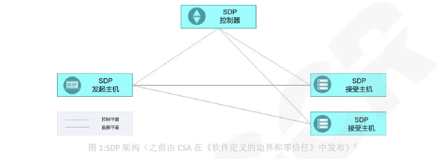
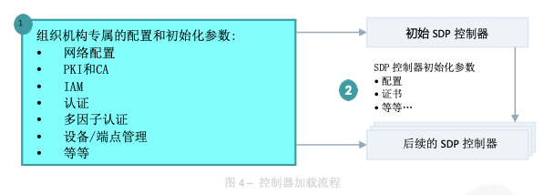
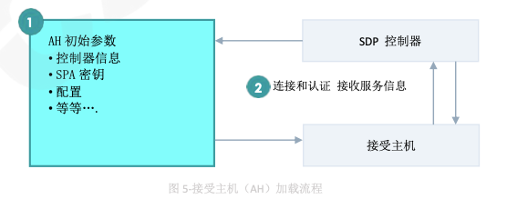
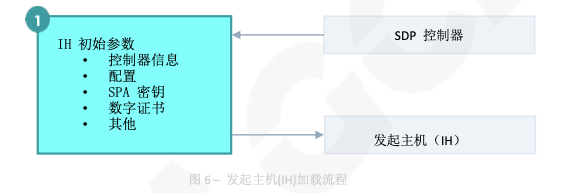
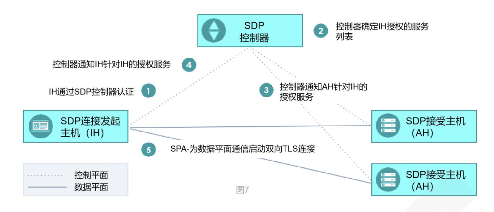
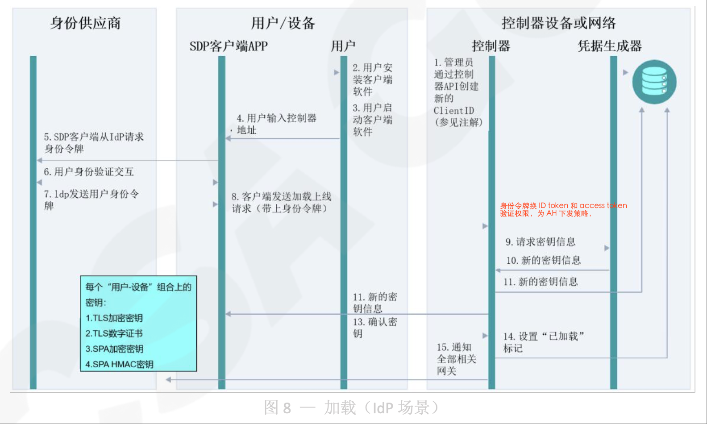
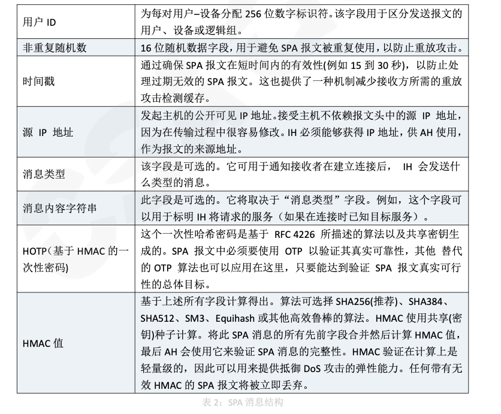

# SDP 软件定义边界

## SDP 设计

SDP 将 物理的安全设备 替换为 安全逻辑组件，无论组件 部署在何处，都在企业的控制之下，从而最大程度地收缩逻辑边界。  
SDP 执行零信任原则，即强制执行 最小特权访问、假设被入侵、以及“信任但验证”，仅在 **认证和身份验证** 成功后，基于 **策略** 来授权 对**资源**的访问。  
SDP 的设计初衷是为 IPv4 和 IPv6 网络 提供有效且易于集成的安全架构，包括对 控制平面组件的保护 和 访问控制。  
SDP 为 跨数据平面通信 的机密性和完整性提供保障，  
还包括一个“需知访问“模型，要在经过 **设备验证** 以及 **身份认证(用户和非人类实体NPE)** 成功之后 才能 **以加密方式** 登录到边界网络。  

SDP 的设计理念上 提供多个层次的无缝集成 - 包括用户、用户设备、网络 和 设备的安全。  
SDP 适用于任何基于 IP 的基础设施，无论是基于硬件的传统网络、软件定义网络(SDN)，还是基于云计算的基础设施。  
SDP 的 **双向验证隧道** 实际上是一个加密层，可以部署在任何一种 IP网络 之上。  
因此，SDP 能将多个异构的环境统一成通用的安全层，从而简化了 网络、安全和运维。

传统的网络安全解决方案侧重于 保护网络 和 系统的安全，而 SDP 侧重于 **以身份为中心** 保护数字资产。  
从 **传统边界防护** 转变到 SDP，使企业能够更加从容地应对 DDoS、凭证失窃 和 对企业资源的勒索软件等攻击。

### 2.1 SDP 概念

SDP 聚焦于保护组织机构的 **关键资源**，而非 组织机构的 **边界**。  
它能够为**网络的所有层面** 定义和执行基于风险的、动态的，以身份为中心的、且上下文感知的访问策略。  

SDP 能够为 **应用程序** 和 **企业资源所有者** 提供的边界防护能力有:

- 可以将服务安全部署到假定被入侵的网络上(即“假定被入侵”)。
- 通过 **不受信任的网络** 访问企业资源 时，可以精细化调整用户身份权限。
- 一个典型的用例是替换VPN。

SDP 使用 由应用负责人控制操作的逻辑组件 取代了传统边界防御设备(通常是物理的)。  
SDP 通过 访问策略 进行 设备认证和身份验证 后，才允许用户对应用程序的访问。  
通常在机密或“高端"网络中，所有 服务器 都隐藏在 远程访问网关设备 后面，用户必须完成身份验证，才能被授予 服务的可见权限 并开放访问通道。  

SDP 保留了上述“需知”(最小特权)模型的优点，同时克服了必须借助远程访问 网关设备 的不足。  
事实上，SDP **访问控制设计**的初衷 是面向所有用户，而不仅仅是远程用户。  
SDP 要求 任何终端 在获得对受保护的服务器和相关服务的网络访问权之前,  
首先要进行终端的身份验证 和 鉴权，然后就在 请求系统和应用程序 之间 **实时创建加密连接**。  
概括来说，SDP 可以在对相关资源(如用户、设备和服务)完成安全验证后，允许其在一个特定边界中访问所需的服务，这些 **服务** 对未经授权的**资源** 保持不可见。

### 2.2 SDP 的架构与组件

简单讲 SDP 由两个逻辑组件构成 SDP主机(分为发起主机和接收主机) 和 SDP 控制器。  

SDP 主机，通常是 全栈主机或轻量级服务，可以 发起或接受连接。  
这些动作由 SDP 控制器管理，通过 控制平面上的安全信道 交互。  
数据 则通过 数据平面中单独的安全信道 通信。  
控制平面与数据平面 分离，实现系统架构的灵活性且高度可扩展性。  
此外，出于规模化或可用性的目的，所有组件均可以做冗余部署。  

SDP 主机(发起主机或接受主机)与SDP控制器 进行通信，  
SDP 控制器 是一个设备或服务器进程，它确保用户经过身份验证和授权、以及设备得到验证，并建立安全通信，保证网络上的 数据流量 和 控制流量 是分离的。

SDP 的架构由以下组件组成:

- SDP控制器一该组件的设计初衷是 用于管理所有的身份验证和访问流程。  
SDP控制器 本质上是整个解决方案的“大脑"，负责定义和评估相应访问策略。  
它充当了零信任架构下的 策略决策点(PDP职能)。  
SDP控制器 负责同企业身份验证方(例如，身份提供商IdP、多因子身份验证MFA服务)的通信，统一协调 身份验证和授权 分发。  
它是一个中心控制点，用于查看和审计所有被访问策略定义的合法连接。

- 发起主机(IH)-这类访问实体 可以是用户设备或NPE(非人类实体)，例如，硬件(如终端用户设备或服务器)、网络设备(用于网络连接)、软件应用程序和服务等。  
SDP用户 可以使用 SDP客户端 或浏览器来发起 SDP连接。

- 接受主机(AH)-这些实体是逻辑组件，通常被放置在受SDP保护的应用程序、服务和资源的前端。  
AH 充当零信任架构下的策略执行点(PEP职能)。  
PEP 通常由具备 SDP功能的软件或硬件实现。  
它根据 **SDP控制器的指令**来执行网络流量是否允许发送到目标服务(可能是应用程序、轻量级服务或资源)。  
从逻辑上讲，AH 可以与目标服务可以部署在一起或者分布在不同网络上。

这些 SDP组件 可以部署在本地或云上，出于扩容或可用性目的可以进行冗余部署

#### SDP 控制器

SDP 控制器是一个 关于策略的定义、验证和决策的组件(零信任架构中的策略决策点 PDP)，  
其维护的信息包括: **哪些身份**(如用户和组)可以通过 **哪些设备** 访问组织架构中的服务(本地或云中)。  
SDP控制器决定了哪些 SDP 主机 可以相互通信。

    一旦 用户(在发起IH上)连接到 SDP控制器，SDP控制器 将对该用户进行身份验证，并根据用户的上下文(包括身份和设备属性)判定是否允许其访问被授权的服务(通过AHS)。  

    为了对用户进行身份验证,SDP控制器 可以使用内部用户表或者连接到第三方的身份和访问管理(IAM)服务(本地或云中)执行认证，并且可以加上多因子认证(MFA)。  

    身份验证方式 通常基于不同用户类型和身份。
    例如，企业员工 可以通过 **身份验证提供商** 进行身份验证，而外部承包商可以通过存储在数据库中的凭据或使用联合身份进行身份验证。  

    为了对用户访问服务进行授权，控制器可以使用内部的“用户到服务”映射策略模型，或第三方服务:如 LDAP、活动目录(AD)或其他授权解决方案(本地或云上的)。 

    授权通常由 用户角色 和 细粒度信息决定:基于 用户或设备属性，或者用户被授权访问的实际数据元素/数据流。  

    实际上，SDP控制器 所维护的访问控制策略 可以由其他组织型的数据结构(如企业服务目录和标识存储)来输入。  

    通过这种方式，SDP控制器 实现了NIST定义的零信任原则中的 **动态零信任策略**。

    此外，SDP控制器可以从外部服务获取信息，例如地理位置信息或主机验证服务，以进一步验证(在IH上的)用户。 

    此外，控制器可以向其他网络组件提供上下文信息，例如有关用户身份验证失败或访问敏感服务的信息。  

    SDP 控制器与零信任 PDP概念组件密切相关。  
    根据 SDP架构的配置需求，它可以部署在云上或本地。

    SDP 控制器 由 单包授权(SPA)协议的 隔离机制 保护，使得 SDP控制器 对未授权的用户和设备不可见和不可达。  
    该保护机制 可以由 SDP控制器前端的 SDP网关 提供，也可以由 SDP控制器 本身提供。

#### SDP 发起主机IH

SDP 的 发起主机IHs 与SDP控制器通信，以便开启通过 接受主机来AH 访问受保护的公司资源的过程。  
SDP控制器通常要求 发起主机IH 在认证阶段提供用户身份、硬件或软件清单以及设备健康状况等信息。  
SDP控制器 还必须为 发起主机IH 提供某种机制(如凭证密钥)，以便 发起主机IH 与接受主机AH 建立安全通信。  

发起主机IH 的形式可以是安装在终端用户机器上的 客户端程序 或 Web 浏览器。  
使用 客户端程序 可以提供更丰富的能力，例如主机检查(设备安全状态检查)、流量路由和更便捷的身份验证。  

发起主机IH 最重要的作用之一 是使用 SPA启动连接，本文稍后将对此进行详细讨论。  
在某些实现中，SPA报文 可能由基于浏览器的 SDP客户端 生成。  

发起主机IH 可以是人类用户的设备(如员工或承包商的计算机或移动设备)、应用程序(如胖客户端)或是物联网(I0T)设备(如远程水表)。

#### SDP 接受主机AH

接受主机AH 是 SDP策略执行点(PEP)，用于 **隐藏** 企业资源(或服务)以及 **实施** 基于身份的访问控制。  
接收主机AH 可以位于本地、私有云、公共云等各种环境中。

受 接收主机AH 保护的服务 不仅限于 Web 应用程序;  
可以是任何基于 TCP 或 UDP 的应用程序，例如 SSH、RDP、SFTP、SMB 或胖客户端访问的专有应用程序。  

默认情况下，对 接受主机AH 的任何网络访问 都被**阻止**，只有经过身份验证和授权的实体才能访问。  
如上所述，接受主机AH 可以与目标服务 部署在一起，或者分布在不同的网络上。  
这些模型如图2所示。  

接受主机AH 从 SDP控制器 接收控制信息，并只接受 经过控制器确认的 那些发起主机IH的连接请求。  
利用从 SDP控制器 接收到的控制信息，接受主机AH 保证 只有经过授权的 发起主机IH(包括用户和设备)才能访问到受保护的服务。  
接受主机AH 作为安全通信的交换站，从 发起主机IH 接收访问流量 然后转发到 被保护的后端服务。  
后端服务的响应信息 通过接受主机AH 返回到 发起主机IH。

SDP是一个面向连接的逻辑层协议，可以用来保护多种网络拓扑架构。  

### 2.4 SDP 工作流程

SDP组件 工作流程流 通常分为两种独立的类型:  

- 加载(0nboarding)流程(每个组件均有独立流程)
- 访问流程(在多个组件之间协调)。

#### 2.4.1 控制器加载(Onboarding)流程

每个 SDP 系统都需要一个或多个控制器。  
为了让加载流程得以成功，至少必须保证有一个控制器在任何时候都是可用的。  
SDP控制器 必须是 可从其他任何 SDP组件的运行位置进行网络访问。  
因此，它们通常是可通过互联网在全球范围内可达，但 *仅限于* 获得授权的 用户/设备

SDP控制器 的工作流 如图4所示:  
一个初始的(主要的)SDP控制器 被引入服务，并连接到适当的、可选的身份验证和授权服务(例如，PKI颁发证书机构服务、设备身份验证、地理位置、SAML、OpenID、0Auth、LDAP、Kerberos、多因子身份验证和其他此类服务)。  
SDP控制器 应该时刻在线，以便对任何其他SDP组件随时可用。  
如有必要，也可以让后续更多的控制器上线，并使用相同的组织机构的专属配置，  
以及来自初始控制器的初始化参数(配置)信息加载。

#### 2.4.2 接受主机AH 加载流程

每个 SDP系统 都需要一个或多个接受主机AH。  
它们可以使用上述的任何 SDP 部署模型进行部署。  
也就是说，它们可以是独立的网关，也可以作为服务器(资源/业务系统)的一部分部署。  
AH 可以是长期在线的，也可以是短暂的--两者在SDP 实施中都是可以接受的。  
独立网关AH 可能寿命较长，运行数月或数年。  
但也可能是短暂的，如在基于负载进行扩展或收缩的动态网关集群中。

部署在单个服务器(业务系统)中的 接受主机AH 在线时间可长可短。  
在这种场景下，它们的生命周期将与它们所属的服务器实例的生命周期绑定在一起。  
服务器实例可以是长期存在的,例如 传统的 Web 或应用服务器;也可以是短期存在的，如DevOps基础设施的一部分服务。

AH 加载流程 如图5所示:  
当 接受主机AH 投入使用时，它们**必须连接到** SDP系统中的一个或多个控制器 并进行认证。  
一旦加载成功，它们就可以接收 SPA 报文，并处理 来自授权发起主机IH 的访问。

#### 2.4.3 发起主机IH 加载流程

**发起主机IH** 可以是 用户设备、或非用户操作的系统(如物联网设备或充当IH的服务器)。  
与SDP系统中的其他所有组件一样，发起主机IH 也需要加载，如图6所示。  

在这个流程中，它们首先需要 被配置 连接到控制器所需的初始参数信息:  
包括网络信息(主机名或IP地址)，以及任何必要的共享密钥(例如，SPA密钥、数字证书)。  
通常，发起主机IH 加载流程 需要使用到企业身份管理服务供应商，并且在用户设备上 需要做用户身份认证。

IHs只需要加载一次，之后就可以启动访问流程。

#### 2.3.4 数据访问流程

发起主机IH 启动访问流程 以连接 被 SDP系统 保护的业务系统(资源)，参考表1和图7。

访问流程涉及了 SDP全部组件:发起主机IH，控制器，接受主机AH。

步骤访问流程：

1. 当已加入的 发起主机IH 重新上线时(例如，在设备重新启动后，或当用户启动连接时)，它将连接到 SDP 控制器进行身份验证。  

2. 在 发起主机IH 身份验证(在某些情况下，使用其相应的身份提供商)成功后，SDP控制器 会确定该 发起主机IH 是否有权(通过 AH)通信的服务列表。  
注意：但此时 SDP控制器 尚未将此列表发送给 发起主机IH;必须等到步骤3之后。  

3. SDP控制器指示 接受主机AH 可以接受来自 发起主机IH 的通信，以及向 接受主机AH 发送用于建立 用户、设备 和 服务之间 双向加密通信 所需的信息。

4. SDP控制器 向 发送主机IH 提供 已授权的 **接受主机AH** 和 **服务列表**，以及建立 双向加密通信 所需的任何可选信息。

5. 发起主机IH 使用 SPA协议 发起与 授权接受主机AH 的连接，首先验证 SPA 中的信息以确保安全，然后 发起主机IH 建立与 接受AH 之间的双向 TLS(mTLs)加密连接。

### 2.5 发起主机IH 加载流程示例

SDP 控制器、发起主机IH、接受主机AH 和 用户的加载，根据图 2 所示的部署模型以及具体实现方案的不同情况会有差异。  
SDP 系统 的创建和运行 可以通过应用程序编程接口(API) 或 管理界面进行。  

如上述流程所述，当 SDP系统 部署和配置完成之后，控制器 和 接受主机AH 上线。  

以下时序图 是使用了外部身份提供商(ldP)进行身份验证的 发起主机IH 用户 加载流程

    注解:
    此示例使用身份提供商(IdP)的信息用于用户加载上线。  
    加载系统 可以包括多因子认证功能，例如 MFA 和设备属性验证(如企业部署的数字证书或终端管理软件)。  
    此示例还省略了向各节点分发密钥信息(如 SPA密钥 或其他共享密钥)的步骤，该步骤和SDP 的实现方案有关。  
    例如，开源 SDP 实现方案中会生成此密钥信息，然后依赖企业的部署方式 将密钥安全地传输给SDP的组件。
    
    在该示例 工作流程中，发起主机IH 使用客户端(上图中的SDP客户端)与身份提供商(IldP)协商。  
    值得注意的是，对于某些SDP产品模型，SDP控制器 将与IdP建立起信任关系(例如，验证客户端转发给它的 SAML 令牌)。

### 2.6 单包授权(SPA)

SDP 的核心原则之一是，任何未经授权的实体 不仅不能访问业务系统(资源)，还不得访问 SDP 基础设施本身。  
为达到这一目标，要求实体 与任何 SDP 组件连接之前 必须要通过基于 **密码学的授权验证**。  
这种机制提高了 SDP 的安全性和弹性:  
未经授权的实体 无法 与 SDP 组件建立网络连接，因此无法尝试漏洞利用、无法尝试暴力破解或利用被盗的用户账密。  
这与传统的远程访问解决方案(如VPN)形成了鲜明的对比，后者往往暴露在互联网上的所有恶意攻击者面前。

SDP 中 实现这个目标的机制 就是单包授权(SPA)。  
SDP 版的 SPA 是基于 RFC4226HMAC 的一次性密码“HOTP”。

单包授权 SPA 在 SDP 中实现的主要原则如下:

- 隐藏 SDP 系统组件:
控制器 和 接受主机AH 不会 对来自远程系统的任何连接 尝试作出反应，直到它们提供了对该 SDP 系统 合法可信的 SPA 报文。  
具体地说，在基于 UDP 的 SPA 的情况下，主机不会响应 TCP SYN，从而避免了向潜在攻击者泄露任何信息。  
(具体实现示例:配置了“默认丢弃”规则的防火墙)。  
无论是独立的 接受主机AH(SDP网关)，还是逻辑上属于 服务器/业务系统 一部分的 接受主机AH（接受主机也需要向控制器注册），都采用这样的原则。  

- 减轻对 TLS 的拒绝服务攻击:
运行 HTTPS(使用了 TLS)协议的面向互联网的服务器 非常容易 受到拒绝服务(DoS)或分布式拒绝服务(DDoS)攻击。  
SPA 可以减轻这些攻击，  
因为它可以让 服务器在产生建立 TCP 或 TLS 连接的开销之前 快速拒绝未经授权的连接尝试,而同时允许授权连接的建立，即使 Dos 攻击还在进行中。  

- 攻击检测:从 任何其他主机 发往 控制器或 AH 的第一个报文必须是 SPA 报文。  
如果 接受主机AH 收到任何其他报文，则应将其视为攻击。  
因此，单包授权SPA 让 SDP 能够根据单个恶意报文确定攻击。

值得一提的是，对于 SPA报文 进行验证的计算开销应该是比较轻量的，  
从而提高 SDP系统 抵御 DDos 攻击的恢复能力。

SDP 组件之间的通信 由 SPA发起: 发起主机IH<--->SDP控制器、接受主机AH<--->SDP控制器 和 发起主机IH<--->接受主机AH。  
SPA 报文 使用 UDP 或 TCP 协议，具体取决于所选的实现方案。

基于 UDP 的 SPA 为受 SPA 保护的服务器 提供上述所有安全优势。  

UDP 是无连接协议，其 SPA 机制天然符合 SDP “默认隐藏资源” 的零信任原则，核心原因有两点：  

端口平时处于 “隐身” 状态，无持续监听 UDP 的 SPA 组件（如 SDP 网关）默认不会持续监听某个端口（或仅在极短时间内 “被动等待” SPA 报文）。  
平时，端口在网络扫描工具看来是 “关闭” 或 “无响应” 的 —— 因为没有进程在持续占用端口 并返回状态（如 TCP 的 SYN-ACK）。  
只有当客户端发送正确加密的 UDP SPA 报文（包含身份凭证、资源请求等信息）时，内核网络协议栈 才会临时唤醒端口处理请求：  
验证通过后，动态开放临时通道；验证失败 则直接丢弃报文，不产生任何网络响应（避免给攻击者留下探测线索）。

与基于 UDP 的 SPA 相比，基于 TCP 的 SPA 只具备其中一部分优势。  
具体地说，使用 TCP SPA 的 SDP组件 将向所有远程(和潜在的恶意)用户暴露开放的端口，因此服务器不会被隐藏。  
该服务器也将部分受到 DDos 攻击--它允许从任何远程 IP 地址 建立一个TCP 连接，然后在建立TLS 连接之前执行 SPA 验证。  
TCP 连接比 TLS 连接的资源消耗要小得多,但它确实也会消耗服务器资源,  
使服务器面临一定程度的 DDoS风险。  
总的来说，使用 TCP SPA，TCP 可以让服务器通过识别无效SPA包来鉴别攻击，但这种识别只有在建立 TCP连接之后 才能做到，因此会消耗服务器资源。

#### 2.6.1 SPA 消息格式

虽然不同SDP实现方案的SPA消息格式可能不同，但所有SDP系统都应支持SPA作为在组件之间启动连接的机制。  
值得一提的是，SPA报文创建者 和 接收者 应当具有共享的信任根，因为每个 SPA报文 都需要共享密钥才能构建有效的SPA报文。  
通常来说，这些信息包括在 发起主机IH 和 接受主机AH 的加载流程中。

### 2.7 组件之间的传输层双向认证

SDP 在建立连接的过程需要进行多层次的安全校验。  
第一步是SPA，如上所述。  
下一步，也就是本章节的主题，要求双向认证，它是作为 分布式 SDP组件 之间 建立安全加密连接的关键步骤。  
其他更多的步骤，包括设备和用户安全校验，将在后面讨论。

当 SDP 组件 利用 SPA 进行安全校验和授权后，SDP系统中主要组件之间的连接必须使用TLS，并通过双向身份认证，来确认设备作为 SDP 的授权成员。  
具体而言，发起主机和接受主机(IH-AH)、发起主机到控制器(IH控制器)以及控制器到AH之间的连接必须使用双向认证。  
请注意，TCP 和 UDP 都支持 TLS（在 UDP 情况下，它被称为 数据报传输层安全(DatagramTransportLayerSecurity，简称 DTLS)。  
这两种都适用于 SDP 系统  

不支持双向认证的弱密码软件套件或协议是不可取的，也是不安全的。  
高安全强度的密码和协议确保每个组件 都包含一个由可信机构颁发的有效私钥,通过双向验证数字签名证书,显著降低了中间人(MITM)攻击的可能性。  

这些组件的根证书 必须是企业PKI系统或SDP专用CA。  
它不能依赖预装的或与用户浏览器关联的默认信任的数字证书，因为这些证书有可能会受到假冒攻击，攻击者因此可以伪造来自被假冒的证书颁发机构的数字证书。  

SDP 应实施一种方案，以确保被吊销的证书可以有效地被检测到(例如，使用在线证书状态协议【OCSP】或其他机制)。

无论 SDP 系统使用哪种传输层方案，它都必须能够抵御潜在的攻击，如MITMTLS降级协议攻击(使用 mTLS 可以避免这种攻击)。
