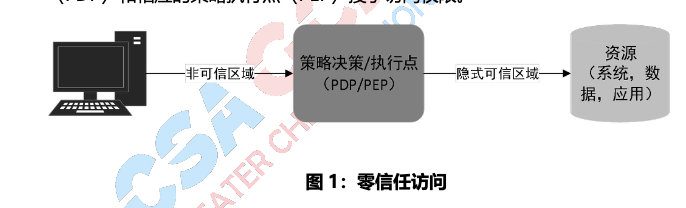
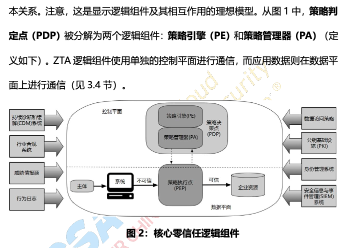
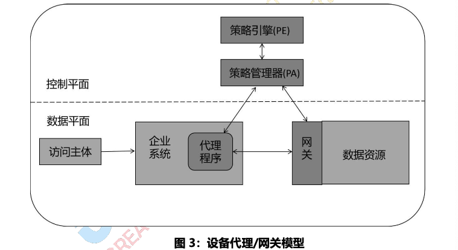
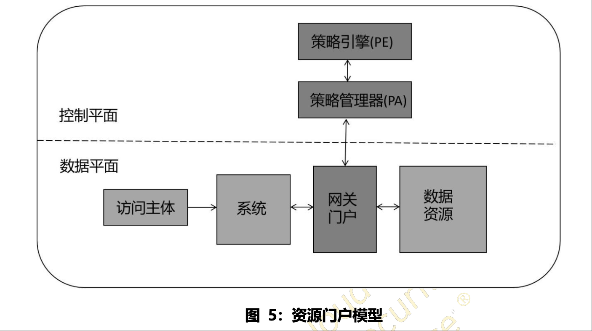

# 零信任ZT

## 零信任架构ZTA

黑核 提倡从基于 边界防御的安全模型 转变为 基于用户操作行为的安全模型。

零信任，用来描述 **从基于网络位置的隐式信任安全模型** 转移到 **基于用户行为的持续信任评估安全模型**。

传统上，组织机构(和一般的企业网络)专注于边界防御，合法认证用户 被授予广泛的资源访问权限。这并不安全。

零信任(Zero Trust，ZT)提供了一系列概念和思想，在假定 网络环境 已经被攻陷的前提下，当执行 信息系统 和 服务中的每次访问请求时，降低 访问请求 决策准确度的 不确定性。

零信任架构(ZTA)则是一种 企业网络安全的规划，它基于零信任理念，围绕 零信任架构 ZTA 的 组件关系、工作流规划 与访间策略 构建而成。

为了 达到 降低不确定性的目的(因为它们不能完全消除)，重点是 **通过身份验证**、**合法授权** 和 **缩小隐含信任区域**，同时 **最小化认证机制中的时间延迟** 来实现。
访问规则 被限制为 最小权限，并尽可能 细颗粒度。

### 零信任访问的 抽象模型

在 零信任访问的 抽象模型中，当主体 需要访问企业资源时，其 需要 通过 策略决策点(PDP) 和 相应的 策略执行点(PEP) 授予访问权限。  

### 零信任访问的核心组件 PDP和PEP

零信任访问系统 必须确保 用户可信 且请求合法。  
PDP/PEP 会 做出合适的判断 以允许主体访问资源。  
这意味着 零信任 适用于两个基本领域: 身份验证 和 授权。  

企业 需要 为资源访问 制定和维护 基于风险的动态策略，并建立一个系统 来确保这些策略 得到正确和一致的执行。  
这意味着 企业 **不应依赖于** 隐含的可信性。  
所谓 隐含可信性 是指: 如果用户满足基本身份验证级别(如，登录到某个资产)，则 假定所有资源请求 都同样合法。

#### 隐含信任区

“隐含信任区” 表示一个区域，隐含信任区中 所有实体都至少被信任到 最后一个 PDP/PEP 网关的级别。  
例如，可以参考机场的乘客安检模型。  
乘客通过机场安检点(PDP/PEP)进入登机口。  
乘客可以在候机区内闲逛，所有通过检查的乘客都被认为是可信的。  
在这个模型中，隐含信任区域是 登机区

PDP/PEP 采用一系列的 控制策略，使得 **所有通过检查点之后的通信流量** 都具有一个共同信任级别。  
PDP/PEP 不能 对访问流量 使用超出其位置的策略。  
为了使 PDP/PEP 尽可能明确，隐含信任区 必须尽可能小。  
零信任架构提供了一套原则和概念，使得 PDP/PEP 更接近资源。  
其思想是 显式地验证 和 授权企业的 所有用户、设备、应用程序 和 工作流。

##### 零信任架构设计和部署遵循以下基本原则

1. 所有 **数据源** 和 **计算服务** 均被视为资源。
2. 无论 网络位置 如何，所有通信都必须是安全的。
3. 对 企业资源 的 **访问授权** 是 **基于每个连接的**。
4. 对资源的访问权限 由动态策略 (包括 客户身份、应用 和 请求资产的可观测状态) 决定，也可能 包括其他行为属性。
5. 企业应该 监控 并且 测量 其所有自有或关联的资产的完整性和安全态势
6. 所有资源的身份认证 和 授权 是动态的，并且 在资源访问被允许之前 严格强制实施。
7. 企业应该尽可能收集关于 **资产**、**网络基础设施** 和 **通信的当前状态信息**，并将其应用于改善网络安全态势。

### 策略决策点 PDP

策略判定点 PDP 可分为 策略引擎PE 和 策略管理器PA

#### 策略引擎(Policy Engine,PE)

该组件 负责 最终决定 是否授予指定访问主体 对资源(访问客体)的访问权限。  
策略引擎 使用企业安全策略 以及来自外部信息源(例如 IP 黑名单、威胁情报服务)的输入作为“信任算法”(TA)的输入，以决定授予或拒绝对该资源的访问。  
策略引擎(PE) 与 策略管理器(PA)组件 配对使用。  
策略引擎 PE 做出决策 并记录决策，策略管理器 PA 执行决策(批准或拒绝)

#### 策略管理器(Policy Administrator,PA)

策略管理器PA 组件 负责 **建立** 和(或)**切断** 主体与资源之间 的通信路径(通过给 策略执行点 PEP 下发命令)。  
策略管理器PA 将为 客户端 生成用于访问企业资源的 任何身份验证令牌或凭证。  
策略管理器PA 与策略引擎 PE 紧密相关，并依赖于策略引擎 PE 决定 最终允许或拒绝 会话。  
如果会话被授权 且请求 已被认证，则 **策略管理器PA** 配置 策略执行点PEP 以允许会话启动。  
如果会话被拒绝(或之前的批准被拒绝)，**策略管理器PA** 向 **策略执行点PEP** 发出信号 以切断连接。  
一些实现 可能会将 **策略引擎PE** 和 **策略管理器PA** 视为单独的服务;这里，它们被划分为两个逻辑组件。  
**策略管理器PA** 在 创建连接时 与策略执行点(PEP)通信。  
这种通信 是通过 控制平面 完成的。

#### 策略执行点(Policy Enforcement Point, PEP)

**策略执行点PEP** 负责 启用、监视 并最终终止 **访问主体和企业资源之间** 的连接。  
**策略执行点PEP** 与**策略管理器PA** 通信，以转发请求 和/或 从 **策略管理器PA** 接收策略更新。  
**策略执行点PEP** 是 **零信任架构ZTA** 中充当通信路径防护的单个逻辑组件；
但 **策略执行点PEP** 也可能分为 **两个** 不同的组件:  
**客户端**(例如,用户笔记本电脑上的 Agent 代理程序)和**资源端**(例如，部署在 资源之前 的 访问控制网关)。  
在 **策略执行点PEP**  组件的后面 就是放置企业资源的 **隐含信任区域**。

## 零信任架构的常见方案

### 3.1.1 基于增强身份治理的 ZTA

    基于 增强身份治理的 ZTA 使用 参与者身份 作为策略创建的关键组件。
    如果 不是请求访问企业资源的主体，则无需创建访问策略。
    对于这种方案，企业资源访问策略 基于身份 和 分配的属性。
    资源访问的主要诉求 是 基于 给定主体身份的访问授权。
    其他因素，如使用的设备、资产状态和环境因素，可以改变其最终信任评分计算(和最终访问授权)，或者以某种方式调整结果(例如，基于网络位置 仅授予对给定数据源的 部分访问权限)。
    保护资源的 策略执行点PEP 组件 必须有能力 可以把请求 转发到策略引擎服务，在 访问授权之前 进行主体身份认证和请求核准。

    基于 增强身份治理 的企业 ZTA 方案 通常使用开放网络模型，或 允许 外部访问者 访问的企业网络，或 允许网络上的常见非企业设备。
    网络访问初始 被授予在具有访问权限的资产上，仅限于 具有适当访问权限 的身份。
    授予基本的网络连接有一个缺点，因为 恶意行为者 仍然可以尝试网络侦查 和/或 利用网络 对内部或第三方发起拒绝服务攻击。
    企业 仍然需要在这种行为影响工作流程之前 对其进行监控和响应。

### 3.1.2 基于微隔离的 ZTA

    企业 可以将单个或一组资源 放在 由网关安全组件保护的 私有网段上 来实施 ZTA 零信任架构。
    在这种方案中，企业 将智能交换机(或路由器)、下一代防火墙(NGFWs)等基础设施设备 或 特殊用途的网关设备 作为保护每个资源(或一小组相关资源)的 策略执行点 PEP。
    或者(或额外)，企业 可以选择 使用软件代理(见第 3.2.1节)或端点资产上的防火墙 来实现基于主机的微隔离,这些网关设备 动态授权 来自于客户端资产的各个请求。
    根据模式的不同,网关 可以是唯一的 PEP(Policy EnforcementPoint)组件，也可以 是由 网关 和 客户端代理 组成的多部分PEP的一部分。
    
    由于 保护设备 充当 PEP，而 该设备的管理 充当 PE/PA 组件，因此 该方法适用于 各种用例和部署模型。
    此方法 要求 身份管理程序(IGP)完全发挥作用，但依赖网关组件 充当 PEP，从而 保护资源 免受未经授权的访问和/或发现
    
    该方案 关键必要的一环 是对 策略执行点 PEP 组件 进行管理，并应能够 根据需要 做出反应和重新配置，以应对威胁或工作流的变化。
    可以通过使用一般的 网关设备 甚至 无状态防火墙 来实现微隔离企业的某些功能是可行的，但是管理成本和快速适应变化的难度 使这成为非常糟糕的选择。

### 3.1.3 基于 网络基础设施 和 软件定义边界 SDP 的 零信任架构ZTA

最后一种方案是 使用 网络基础设施 来实现 零信任架构ZTA。  
零信任的实现 可以通过使用 **顶层网络** 来实现(即第7层，但也可以将其部署在更低的 ISO 网络协议栈)  
这种方案有时称为 **软件定义边界(SDP)方法**，并且 经常包含 SDNISDNBOOK 和 基于意图的联网[IBN](IBNVN)的概念。  
在这种方案中，**策略管理器PA** 充当 **网络控制器** 根据 **策略引擎PE** 做出的决定 来 建立和重新配置网络。  
客户端 继续请求 通过 策略执行点PEP(由 策略管理器 PA 组件 下发策略给 策略执行点 PEP 进行新的网络配置) 进行访问。  

当在 **应用网络层(即第7层)** 实施该方案时，最常见的部署模型是 **设备代理-网关 模型**。  
在此实现中，**设备代理** 和 **资源网关** 组成单个 PEP (由 策略管理器PA 下发网络配置) 建立用于 客户端和资源之间 通信的安全通道。  

## 零信任架构的部署模式

### 3.2.1 基于 设备代理-网关 的部署（类似于 Istio 的部署模式，每一个服务之前都有一个 envoy 网关代理）

在此部署模型中，**策略执行点PEP** 分为两个组件，一个驻留在资产上 **客户端Agent**，另一个直接位于资源前面的**资源网关Gateway**。  
例如，每个 企业分配的资产上 都有个已安装的 **设备 Agent 代理程序** 用于创建和管理连接，  
并且 **每个资源** 都有一个组件即**资源网关Gateway**， 放置在 资源的最前面，以便 资源 仅与**资源网关Gateway**通信，该 资源网关组件 本质上 充当资源的代理。  
**设备代理Agent** 是一个软件组件，它将 部分(或全部)流量 引导到 相应的 **策略执行点PEP**(具体执行策略的地方)，以便对请求进行规则匹配评估。  
**资源网关Gateway** 负责连接到 **策略管理器PA**，并对由 **策略管理器PA** 配置 所允许的通信 放行(请参见图 3)  

举一个典型场景为例，一个用户 希望通过 **企配的笔记本电脑** 连接到一个特定 **企业资源**(例如，人力资源应用程序(计算资源)/数据库(数据资源))。  
该访问请求 由本地 **设备代理Agent** 接收，然后 将请求发送给 **策略管理器PA**。  
**策略管理器PA** 和 **策略引擎PE** 可以是企业 本地部署产品 或 云托管服务。  
**策略管理器PA** 将请求转发到 **策略引擎PE** 进行评估。  
如果请求被授权，则 **策略管理器PA** 配置 **设备代理Agent** 与相关 **资源网关Gateway** 之间 的通信通道。  
这可能包括 网际协议(IP)策略管理器 PA 将请求转发到策略引擎PE 进行评估。  
如果请求被授权，则策略管理器PA 通过 控制平面 在配置 **设备代理程序Agent** 与对应的 **资源网关Gateway** 之间 配置一个连接通道。  
这可能包括 IP 地址，端口信息，会话密钥 或类似的安全元件。  
然后，设备 **设备代理程序Agent** 和 **资源网关Gateway** 连接，加密(wireguard) 的应用程序数据流 开始工作。  
当 工作流完成 或 由 **策略管理器PA** 触发 安全事件(例如，会话超时、无法重新认证) 时，**设备代理Agent** 与**资源网关Gateway** 之间 的连接 将终止。

### 3.2.2 基于飞地的部署（类似于 supos 网关的部署模式）

此部署模型 是上述 设备代理/网关模型 的变体。  
在这个模型中，**网关组件Gateway** 可能 **不驻留** 在某个资源的前面，而是 **驻留**在 **资源飞地(例如，本地数据中心)的边界上**(如图4所示)。  
通常，这些 资源 仅用于实现单个业务功能，或者它们 可能无法 与网关 直接通讯(例如，一些陈旧数据库系统可能没有 API接口 可以与网关通信[API])。  
这个 部署该模型 也可以应用于 基于云上微服务的业务流程(例如，用户通知、数据库查询、工资支出)。  
在这个型中，整个私有云 位于 **网关Gateway** 后面。  

该模型 可以和 设备代理/网关模型进行混合部署。  
在这个模型中，企业设备资产上安装一个代理程序 Agent，用于连接飞地的网关，创建这些连接的过程和上面提到的 设备代理/网关模型的使用 的过程是一样的。  
该模型 可以应用于企业比较陈旧的应用程序 或者 在 无法独立部署网关的本地数据中心。  
企业需要一个 比较强大的设备和配置管理系统 来安装和配置所有终端上的 代理程序(Agent)。  
这个模型的缺点是 **网关**只能保护一组资源 **而非**每个独立的资源，这将导致访问主体可能会看到一些他们不该看到的资源。  

### 3.2.3 基于资源门户的部署

在此部署模型中，策略执行点PEP 是充当用户请求网关的唯一组件。  
网关门户既可以用于单个资源，也可以用于实现单个业务功能的一组资源 所处的飞地。  
例如，通过网关门户 连接到运行老旧应用程序的私有云或数据中心(如图5所示)

